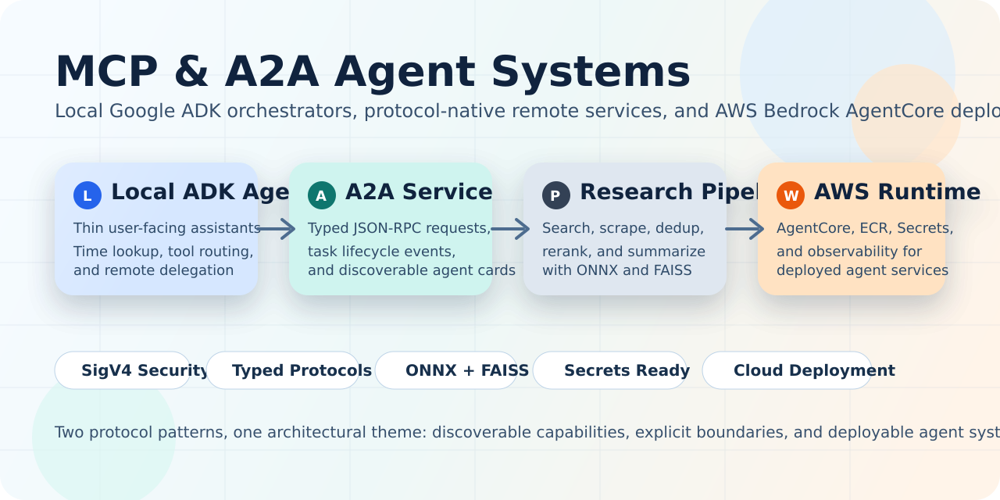
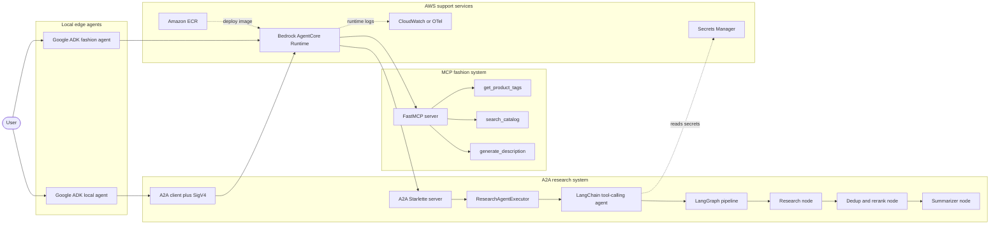
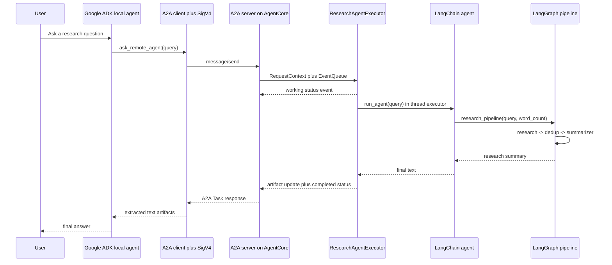
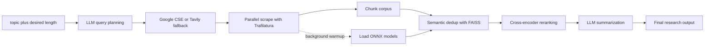
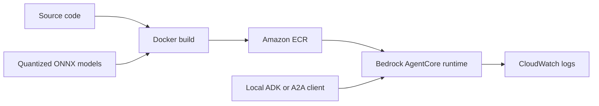

<p align="center">
  
</p>

<p align="center">
  
  
  
  
  
  
  
  
</p>

# MCP and A2A Agent Orchestration on AWS Bedrock AgentCore

This repository showcases two complementary interoperability patterns for agent systems:

- An **A2A research agent** that exposes a LangChain and LangGraph workflow as a protocol-compliant remote service.
- An **MCP fashion tool server** that exposes domain tools over FastMCP and can be consumed by a local assistant.

Across both tracks, the same architectural idea shows up repeatedly: keep the **user-facing assistant thin**, keep the **domain logic modular**, and make the remote capability **discoverable, typed, secure, and deployable**.

## What Lives In This Repo

| Area | Purpose | Main entry points |
| --- | --- | --- |
| `local_agent/` | Local Google ADK assistant that can answer time queries directly or delegate research to a remote A2A agent | `local_agent/agent.py` |
| `a2a_protocol/` | A2A server, executor, LangChain wrapper, LangGraph research pipeline, provider abstractions, AWS-aware deployment | `a2a_protocol/server/a2a_server.py`, `a2a_protocol/server/agent_executor.py`, `a2a_protocol/agent/langchain_agent.py`, `a2a_protocol/pipeline/graph.py`, `a2a_protocol/deploy.sh` |
| `a2a_protocol/models/` | Quantized ONNX embedding and reranking artifacts used for local semantic deduplication and ranking | `a2a_protocol/models/embedding/`, `a2a_protocol/models/reranker/` |
| `fashion-mcp-server/` | FastMCP server with fashion-domain tools and AgentCore deployment configuration | `fashion-mcp-server/fashion_tools.py`, `fashion-mcp-server/deploy.sh`, `fashion-mcp-server/.bedrock_agentcore.yaml` |
| `fashion-mcp-server/local_agent/` | Local Google ADK assistant that discovers live MCP tools from AgentCore and wraps them dynamically | `fashion-mcp-server/local_agent/local_agent.py` |

## Why This Repository Stands Out

- It uses **protocols as first-class architecture**, not as an afterthought: A2A for agent-to-agent collaboration and MCP for tool interoperability.
- It keeps **transport, orchestration, reasoning, retrieval, and infrastructure concerns separated** into distinct modules.
- It has a clean **local-to-cloud path**: local testing, Dockerized execution, and AWS Bedrock AgentCore deployment are all represented.
- It adds **practical performance work**, including background model warmup, parallel search and scraping, quantized ONNX models, and FAISS-based semantic deduplication.
- It treats **security and runtime integration seriously**, with SigV4 signing, secret abstraction, `.env` exclusion, and a prepared Bedrock AgentCore memory service module.

## A2A and MCP Side By Side

| Pattern | Used here for | Why it fits |
| --- | --- | --- |
| **A2A** | Packaging the research workflow as a discoverable remote agent with a task lifecycle and structured artifacts | Best when the remote side should behave like an autonomous agent service |
| **MCP** | Packaging fashion-domain capabilities as tools that can be listed, discovered, and called dynamically | Best when the remote side is a tool provider rather than a full autonomous agent |

## Architecture At A Glance



## How The A2A Research Agent Is Orchestrated

The A2A path is intentionally layered:

1. `local_agent/agent.py` runs a **Google ADK assistant** with two tools: a local time lookup and a remote A2A delegation tool.
2. For local testing, that delegation tool can call a local A2A server through `LOCAL_A2A_URL`.
3. For production, it resolves the Bedrock AgentCore runtime ARN, signs requests with a custom `AWSSigV4Auth`, and sends a typed `SendMessageRequest` through the official `A2AClient`.
4. `a2a_protocol/server/a2a_server.py` exposes the discoverable agent card, JSON-RPC endpoint, health endpoint, and an AgentCore-compatible `/invocations` route.
5. `ResearchAgentExecutor` bridges the A2A task lifecycle to the synchronous LangChain agent by offloading execution into a worker thread and streaming task state transitions back through the A2A event queue.

One especially good implementation detail is the production-mode A2A client logic in `local_agent/agent.py`: instead of assuming AgentCore will expose card discovery over GET, it constructs the `AgentCard` directly when the runtime identity is already known. That is a pragmatic protocol adaptation rather than a brittle workaround.



## How The Research Pipeline Works

Inside the A2A service, the reasoning path is split into a compact but well-separated pipeline:

- The **LangChain agent** decides when to call the `research_pipeline` tool and returns the tool output directly.
- The **LangGraph pipeline** keeps the research flow deterministic and modular.
- The **research node** generates search queries, runs parallel search, and starts scraping as soon as URLs arrive.
- The **dedup node** chunks the corpus, warms ONNX models in the background, embeds chunks, removes near-duplicates with FAISS, and reranks by topical relevance.
- The **summarizer node** uses a higher-tier model to produce the final answer at the requested length.



## How The MCP Fashion Tools Are Orchestrated

The MCP side of the repository shows the tool-provider pattern instead of the remote-agent pattern:

- `fashion-mcp-server/fashion_tools.py` exposes a **FastMCP server** with three domain tools: `get_product_tags`, `search_catalog`, and `generate_description`.
- `fashion-mcp-server/local_agent/local_agent.py` first calls `tools/list`, then **builds ADK `FunctionTool` wrappers dynamically** from each tool's input schema.
- Tool invocations are sent back to the deployed runtime over **MCP JSON-RPC** with **SigV4-signed HTTPS** and `Accept: application/json, text/event-stream`.
- This means the local fashion assistant does not need hard-coded wrappers for every tool; it can discover and adapt to the live MCP surface at runtime.

That dynamic schema-to-tool conversion is a strong pattern because it keeps the consumer loosely coupled to the remote server while still letting the local ADK agent use natural tool calls.

## Best Practices Already Followed In The Codebase

| Practice | How it appears here | Why it matters |
| --- | --- | --- |
| **Protocol-first design** | A2A uses `AgentCard`, typed requests, `DefaultRequestHandler`, and an `AgentExecutor`; MCP uses tool registration and live `tools/list` discovery | Keeps interoperability explicit and avoids hand-rolled RPC conventions |
| **Separation of concerns** | Server, executor, agent, pipeline, providers, and services live in different modules | Makes the system easier to reason about, test, and replace incrementally |
| **Secure runtime access** | Remote calls use AWS SigV4; secrets resolve through a dedicated service; `.env` files are excluded from Git tracking and container contexts | Reduces accidental leakage and prepares the code for cloud deployment |
| **Performance-aware retrieval** | Parallel query search, producer-consumer scraping, background warmup, FAISS dedup, ONNX inference, and quantized model artifacts are all in place | Improves latency and keeps the pipeline practical on CPU-based containers |
| **Local and cloud parity** | The same A2A app supports local `/` requests and AgentCore `/invocations`; Docker Compose exists for local container testing | Helps development stay closer to deployment reality |
| **Operational visibility** | Structured logging, `/ping`, health checks, CloudWatch-oriented deployment notes, and OpenTelemetry in the fashion container | Makes distributed debugging much easier |
| **Progressive infrastructure design** | Local env vars are supported now, AWS Secrets Manager is wired for production, and a Bedrock memory service module is ready for future integration | Good balance between developer ergonomics and production readiness |

## Deployment Model

The repository supports two deployment paths.

### 1. A2A Research Agent on Bedrock AgentCore

The `a2a_protocol/deploy.sh` script captures the intended production path:

1. Build the image from `a2a_protocol/Dockerfile`.
2. Push it to Amazon ECR.
3. Update an existing Bedrock AgentCore runtime with the new container image.

The Docker image itself follows a few solid runtime practices:

- Multi-stage build.
- `uv`-based dependency installation for faster image creation.
- Included ONNX model artifacts for CPU-friendly semantic ranking.
- Single-worker `uvicorn` execution so `InMemoryTaskStore` semantics stay correct.



### 2. MCP Fashion Server on Bedrock AgentCore

The `fashion-mcp-server/deploy.sh` path is more toolkit-driven:

1. Install the Bedrock AgentCore starter toolkit.
2. Configure the runtime for the MCP protocol.
3. Launch through AgentCore and let the managed build path publish the container.

The checked-in `.bedrock_agentcore.yaml` file makes it clear that this side of the repo is structured around an AgentCore-managed MCP deployment rather than a fully custom shell-based release flow.

## Quick Start

### Run The A2A Stack Locally

```bash
python3 -m venv .venv
source .venv/bin/activate
pip install -r a2a_protocol/requirements.txt

export OPENAI_API_KEY="your-openai-key"
export GOOGLE_SEARCH_API_KEY="your-google-search-key"
export GOOGLE_SEARCH_ENGINE_ID="your-search-engine-id"
# Optional fallback instead of Google CSE:
# export TAVILY_API_KEY="your-tavily-key"

python -m uvicorn a2a_protocol.server.a2a_server:app --host 0.0.0.0 --port 8080
```

In a second terminal:

```bash
source .venv/bin/activate
python -m a2a_protocol.server.a2a_client --discover
python -m a2a_protocol.server.a2a_client "Explain quantum computing in 250 words"
```

To test the local Google ADK orchestrator against the local A2A server:

```bash
pip install google-adk litellm google-genai
export LOCAL_A2A_URL="http://localhost:8080"
python local_agent/agent.py "Research battery recycling trends"
```

### Run The A2A Stack In Docker

```bash
cd a2a_protocol
docker compose up --build
```

### Deploy The A2A Agent To AgentCore

```bash
cd a2a_protocol
chmod +x deploy.sh
./deploy.sh latest
```

Before reusing that script in another AWS account, parameterize the hard-coded profile, account ID, role ARN, repository name, and runtime name.

### Run The Fashion MCP Server Locally

```bash
cd fashion-mcp-server
python3 -m venv .venv
source .venv/bin/activate
pip install -r requirements.txt
python fashion_tools.py
```

Optional local integration for Claude Desktop is documented in `fashion-mcp-server/claude_desktop_config.json`.

### Deploy The Fashion MCP Server To AgentCore

```bash
cd fashion-mcp-server
chmod +x deploy.sh
./deploy.sh
```

After deployment, install the local consumer dependencies and run the fashion assistant once `OPENAI_API_KEY` and `AGENTCORE_ARN` are set:

```bash
pip install -r fashion-mcp-server/local_agent/requirements.txt
python fashion-mcp-server/local_agent/local_agent.py
```

## Key Environment Variables

| Variable | Used by | Purpose |
| --- | --- | --- |
| `OPENAI_API_KEY` | A2A pipeline and local agents | Primary LLM access |
| `GOOGLE_SEARCH_API_KEY` | Research node | Primary web search backend |
| `GOOGLE_SEARCH_ENGINE_ID` | Research node | Google Custom Search engine selection |
| `TAVILY_API_KEY` | Research node | Fallback web search backend |
| `LOCAL_A2A_URL` | `local_agent/agent.py` | Switches the A2A consumer into local testing mode |
| `AWS_PROFILE`, `AWS_REGION` | Remote A2A scripts and local clients | AWS credential and region selection |
| `AGENTCORE_RUNTIME_NAME`, `AGENTCORE_RUNTIME_ARN` | A2A client scripts | Resolve or pin the Bedrock runtime |
| `USE_AWS_SECRETS`, `AWS_SECRET_ID` | Secrets service | Enable Secrets Manager in production |
| `BEDROCK_MEMORY_ID` | Memory service module | Prepared hook for future persistent memory wiring |
| `AGENTCORE_ARN` | Fashion local agent | Target deployed MCP runtime |

## Professional Assessment

This codebase already follows many of the right architectural instincts for agent systems:

- thin local orchestrators
- protocol-compliant remote services
- typed boundaries
- modular pipeline nodes
- cloud-aware deployment
- pragmatic performance optimization

For a stronger open-source or production-grade release, the next highest-impact improvements would be:

- add automated tests and CI checks
- provide `.env.example` files for each stack
- move account-specific deployment values out of shell scripts and into config or IaC
- align older helper scripts with the latest LangChain to LangGraph execution path
- connect the existing Bedrock memory service module into the active request path if conversational memory is a goal

## Repository Structure

```text
.
├── local_agent/
│   └── agent.py
├── a2a_protocol/
│   ├── agent/
│   ├── models/
│   ├── pipeline/
│   ├── providers/
│   ├── scripts/
│   ├── server/
│   ├── services/
│   ├── Dockerfile
│   ├── docker-compose.yml
│   └── deploy.sh
├── fashion-mcp-server/
│   ├── local_agent/
│   ├── fashion_tools.py
│   ├── Dockerfile
│   ├── deploy.sh
│   └── .bedrock_agentcore.yaml
└── README.md
```

## Summary

If you want one sentence for the GitHub landing page, it is this:

> This repository demonstrates how to build local Google ADK assistants that orchestrate either an A2A research service or an MCP tool server, with deployment paths that reach all the way to AWS Bedrock AgentCore.
